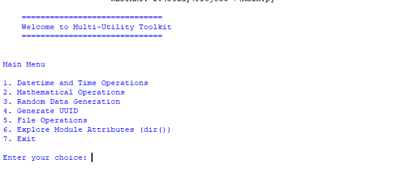
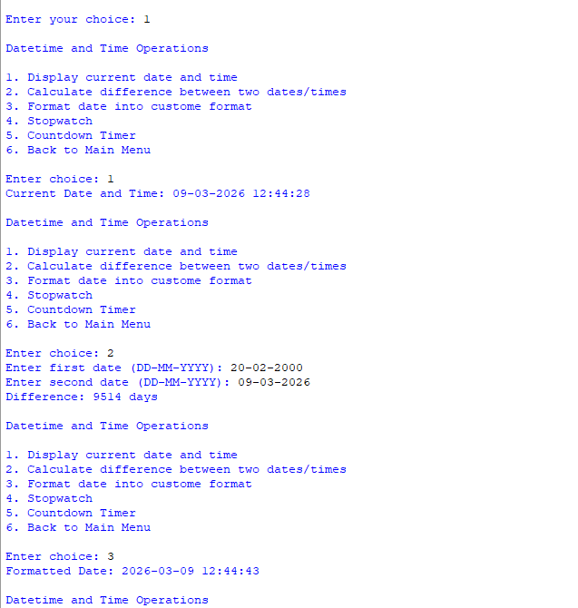
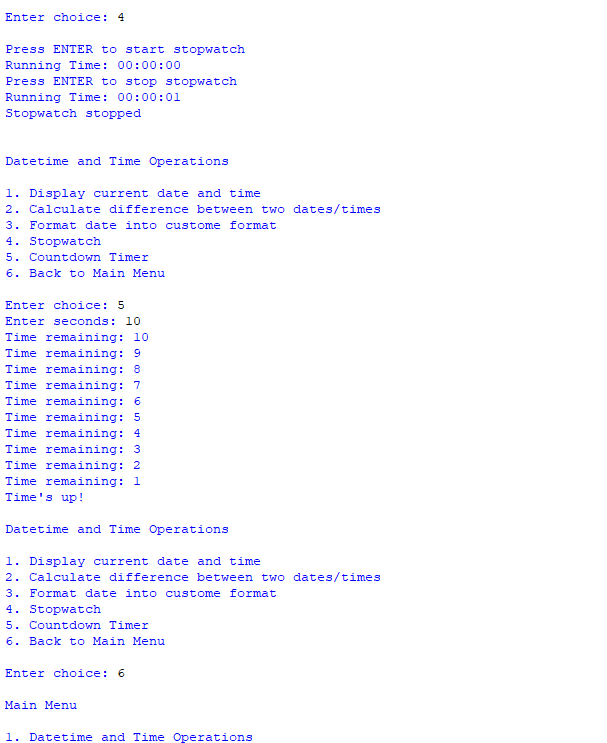
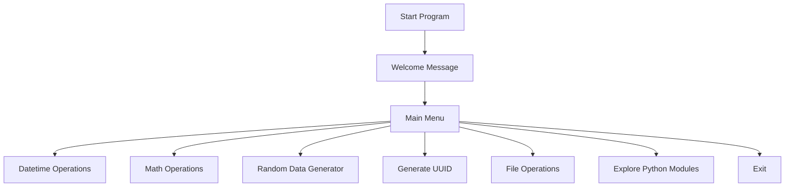
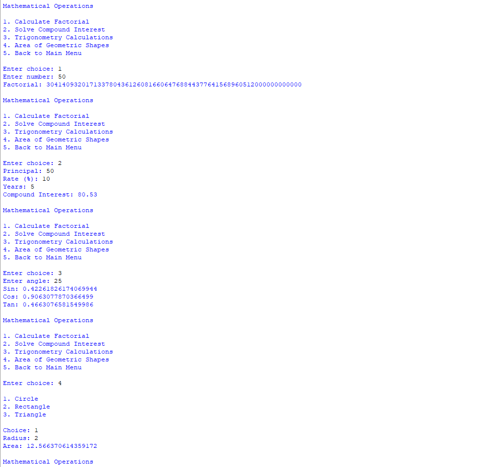
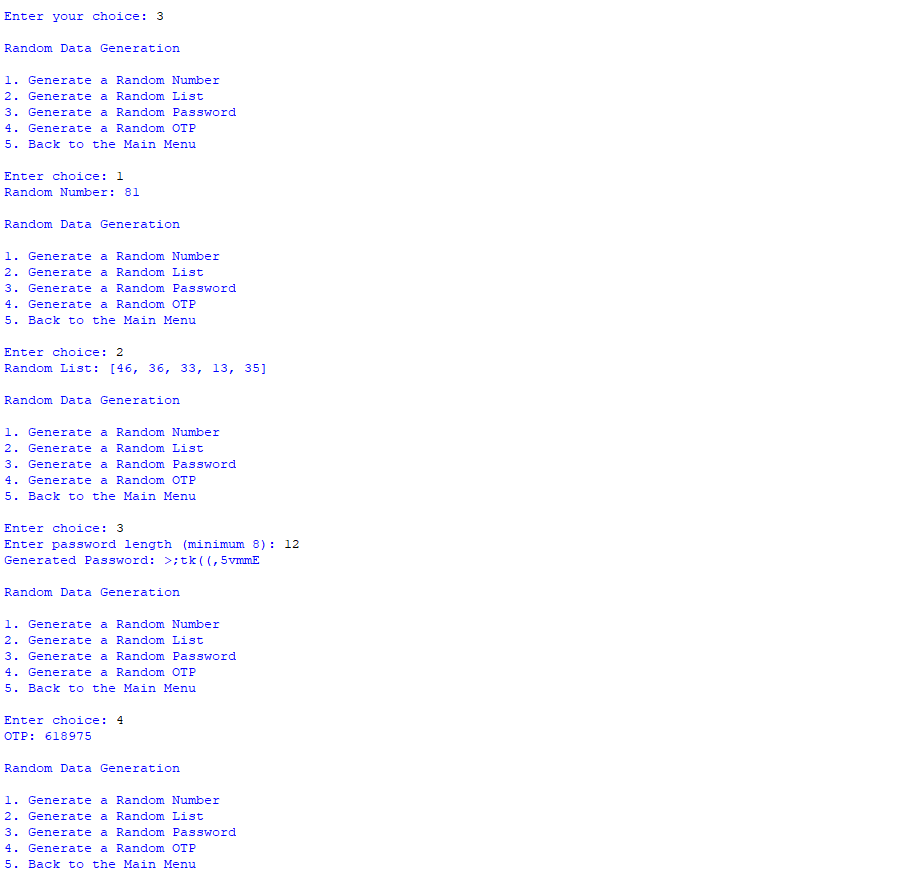
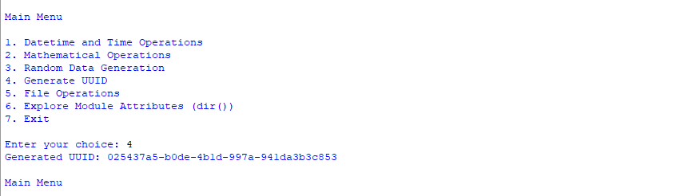
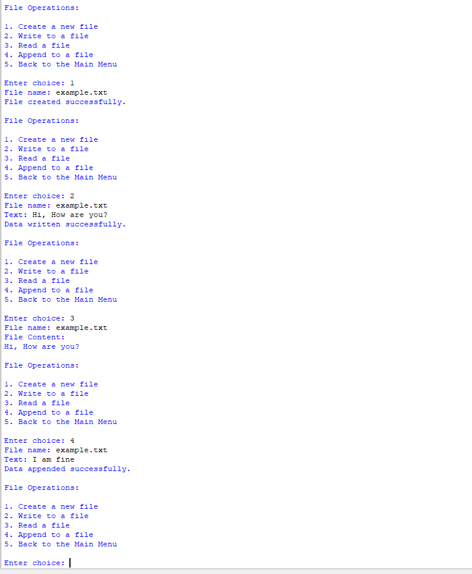
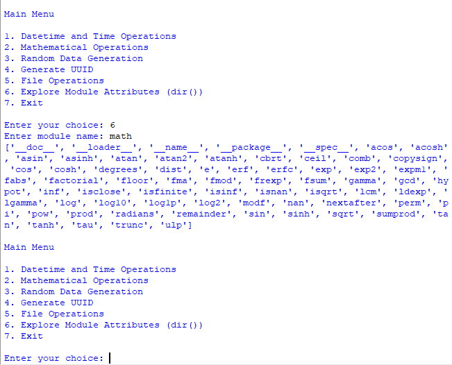
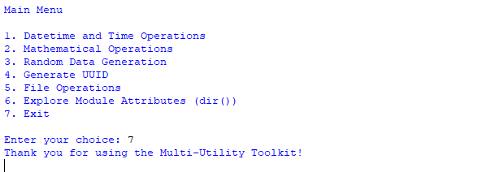

# 🧰 Multi-Utility Toolkit (Python CLI)


---

# 📌 Project Overview

The **Multi-Utility Toolkit** is a modular Python command-line application that provides a collection of useful utilities in one system.

The project demonstrates how Python modules and packages can be combined to build a structured, maintainable, and scalable application.

Users can perform several operations including:

* Datetime utilities
* Mathematical calculations
* Random data generation
* UUID generation
* File operations
* Python module exploration using `dir()`

This project focuses on **modular programming**, separating features into reusable modules for clean architecture.

---

# 🎬 Demo

### Main Menu



---

### Datetime & Time Operations





---

# ⚙️ Features

| Module             | Description                                                                         |
| ------------------ | ----------------------------------------------------------------------------------- |
| Datetime Utilities | Display current time, calculate date difference, format dates, stopwatch, countdown |
| Math Tools         | Factorial, compound interest, trigonometry, geometric area calculations             |
| Random Generators  | Random numbers, lists, passwords, OTP                                               |
| UUID Generator     | Generate universally unique identifiers                                             |
| File Operations    | Create, write, read, and append files                                               |
| Module Explorer    | Inspect Python modules using `dir()`                                                |

---

# 🧠 Skills Demonstrated

* Python modular programming
* CLI application design
* File handling and I/O
* Multithreading (Stopwatch implementation)
* Working with Python standard libraries
* Dynamic module importing
* Mathematical computations
* Random data generation
* Code organization and maintainability

---

# 🧠 Technologies Used

* Python 3
* `datetime`
* `time`
* `math`
* `random`
* `uuid`
* `threading`
* `os`

---

# 🧭 Program Architecture



---

# 📦 Project Structure

```
Multi-Utility-Toolkit
│
├── Main.py
├── math_module.py
├── file_module.py
│
├── utility_package
│   ├── __init__.py
│   └── helper.py
│
├── Screenshots
│   ├── mainmenu.png
│   ├── opt1.1.png
│   ├── opt1.2.png
│   ├── opt2.png
│   ├── opt3.png
│   ├── opt4.png
│   ├── opt5.png
│   ├── opt6.png
│   └── opt7.png
│
└── README.md
```

---

# 🖥️ Application Walkthrough

---

# 🏠 Main Menu

The main menu acts as the central hub of the application, allowing users to navigate between different utilities.


---

# ⏰ Datetime and Time Operations

This module allows users to perform several time-related tasks including:

* Displaying the current date and time
* Calculating the difference between two dates
* Formatting dates
* Stopwatch
* Countdown timer

### Screenshot 1 — Date & Time Features


### Screenshot 2 — Stopwatch & Countdown Timer


---

# 🔢 Mathematical Operations

Users can perform several mathematical computations including:

* Factorial calculations
* Compound interest calculations
* Trigonometry calculations
* Area calculations for geometric shapes



---

# 🎲 Random Data Generation

This section demonstrates Python’s `random` module by generating:

* Random numbers
* Random lists
* Random passwords
* One-Time Passwords (OTP)



---

# 🆔 UUID Generator

Generates a **Universally Unique Identifier (UUID)** commonly used in distributed systems and databases.



---

# 📁 File Operations

Users can perform file management operations including:

* Create a new file
* Write to a file
* Read a file
* Append to a file



---

# 🔎 Module Explorer (`dir()`)

Allows users to explore attributes and functions available in Python modules dynamically.



---

# 👋 Exit Program

Gracefully exits the application.



---

# ▶️ How to Run the Project

Clone the repository:

```
git clone <repository-url>
```

Navigate into the project folder:

```
cd Multi-Utility-Toolkit
```

Run the application:

```
python Main.py
```

---

# 💼 Portfolio Value

This project demonstrates the ability to build structured Python applications using modular programming techniques.

It highlights knowledge of:

* Python modules and packages
* CLI interface design
* Standard library usage
* Multithreading
* File system operations
* Clean code organization

---

# 🔮 Future Improvements

Possible enhancements include:

* GUI version using Tkinter or PyQt
* Operation history logging
* Export generated data
* Additional mathematical utilities
* Encryption tools
* Packaging as a pip-installable toolkit

---
## 🚀 Run the Project in GitHub Codespaces

You can run this project directly in your browser without installing Python locally.

### Steps

1. Click the **Code** button on this repository.
2. Select the **Codespaces** tab.
3. Click **Create codespace on main**.
4. Once the environment loads, open the terminal.
5. Run the following command:

```bash
python Main.py
```

The **Multi-Utility Toolkit** will start in the terminal and you can interact with the menu.

---

## ▶️ Open Directly in GitHub Codespaces

You can also launch the project instantly using the button below:

[](https://github.com/codespaces/new?hide_repo_select=true&repo=dj25325d-gif/Moduler-and-Packager)


---

# 👤 Author

Developed as part of a Python portfolio focused on building real-world CLI utilities and modular Python systems.

---

⭐ If you found this project helpful, consider starring the repository!
